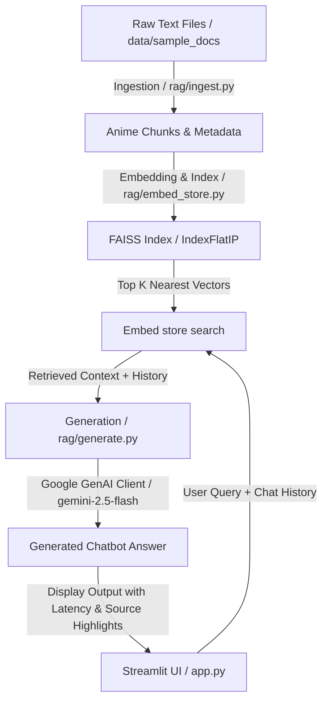

# Anime Recommendation RAG (Retrieval-Augmented Generation) System

Welcome to the **Anime Recommendation RAG System**, a complete, production-grade AI Search & Chatbot assistant designed to answer queries, search plotlines, and recommend anime from a database of top MyAnimeList entries. 

This project implements the **four architecture layers** required for standard Retrieval-Augmented Generation: document ingestion, vector representation/database query, LLM response synthesis, and a front-end Streamlit chat interface.

---

## 🏗️ Core Architecture & Layers



### 1. Ingestion Layer ([ingest.py](file:///d:/Downdloads%20D/CS382/final/final_project_starter_test/final_project_starter/rag/ingest.py))
- **File loading**: Reads plain `.txt` documents containing anime database dumps from the corpus.
- **Tag-based splitting**: Splices anime entries apart by parsing individual XML-like `<ANIME>...</ANIME>` blocks. Each anime block forms a single cohesive document chunk.
- **Metadata parser**: Extracts critical parameters including the anime's **UID**, **Title**, **Rank**, and **Genre** list, mapping them as chunk metadata.

### 2. Retrieval & Indexing Layer ([embed_store.py](file:///d:/Downdloads%20D/CS382/final/final_project_starter_test/final_project_starter/rag/embed_store.py))
- **Semantic representations**: Upgraded from simple lexical TF-IDF to a state-of-the-art **SentenceTransformers** model (`all-MiniLM-L6-v2`). This generates dense 384-dimensional vectors capturing deep contextual meaning.
- **Vector Database**: Leverages **FAISS** (`faiss-cpu`) to structure the embeddings. It uses an inner product flat index (`faiss.IndexFlatIP`).
- **Cosine similarity matching**: Chunks and queries are L2-normalized so that inner product similarity computes true cosine similarity, yielding precise matching at speed.
- **Dynamic indexing**: Supports in-memory database updates, allowing uploaded files to be vectorized and indexed dynamically on-the-fly.

### 3. Generation Layer ([generate.py](file:///d:/Downdloads%20D/CS382/final/final_project_starter_test/final_project_starter/rag/generate.py))
- **Conversational Memory**: Accepts past conversation history, structuring it directly into the prompt context. This enables multi-turn references (e.g. *“Can you tell me more about that first one?”*).
- **LLM Synthesis**: Queries Gemini API (`gemini-2.5-flash`) via the modern `google-genai` SDK.
- **Strict grounding**: Prompts are heavily sandboxed with instructions to answer *only* using retrieved database context, preventing hallucinations.
- **Extractive mode**: Provides an offline, API-key-free fallback that returns the raw matching text chunks.

### 4. Interface Layer ([app.py](file:///d:/Downdloads%20D/CS382/final/final_project_starter_test/final_project_starter/app.py))
- **Conversational UX**: Built as an interactive chat canvas with custom avatars using native `st.chat_message`.
- **Dynamic File Uploader**: Form in the sidebar allows users to drag-and-drop new text files, which are chunked, vectorized, and inserted into the active FAISS index.
- **Latency Diagnostics**: Times and displays exact execution windows for retrieval and generation (e.g., `Retrieval: 4.2ms | Generation: 1.1s`).
- **Term Highlighting**: Employs regular expressions and HTML `<mark>` tags to highlight user search query terms inside source document blocks.

---

## 🛠️ Installation & Setup

Ensure you have **Python 3.10 to 3.12** installed on your system.

### 1. Install dependencies
From the project directory, run:
```bash
pip install -r requirements.txt
```

### 2. Configure API Credentials
To run in **LLM mode**, set your Google Gemini API key as an environment variable:

*   **Windows (Command Prompt):**
    ```cmd
    set GEMINI_API_KEY=your_api_key_here
    ```
*   **Windows (PowerShell):**
    ```powershell
    $env:GEMINI_API_KEY="your_api_key_here"
    ```
*   **Linux/macOS:**
    ```bash
    export GEMINI_API_KEY="your_api_key_here"
    ```

*(If no key is configured, the application fallback is set to return raw extractive text matches.)*

### 3. Launch the Chatbot
Start the Streamlit application:
```bash
streamlit run app.py
```

---

## 📊 Evaluation & Verification

To execute and complete your written evaluation:
1. Open the Streamlit chatbot UI.
2. Select **LLM** answer mode.
3. Test each of the 10 queries listed in [EVALUATION.md](file:///d:/Downdloads%20D/CS382/final/final_project_starter_test/final_project_starter/EVALUATION.md) by typing them into the chat window.
4. Record:
   - The title of the top source retrieved.
   - Whether the retrieval step successfully pulled the target anime context.
   - Quality notes regarding Gemini's answer synthesis (e.g., citations, brief explanation, correctness).
5. Document your reflections in the written evaluation section of the markdown.
